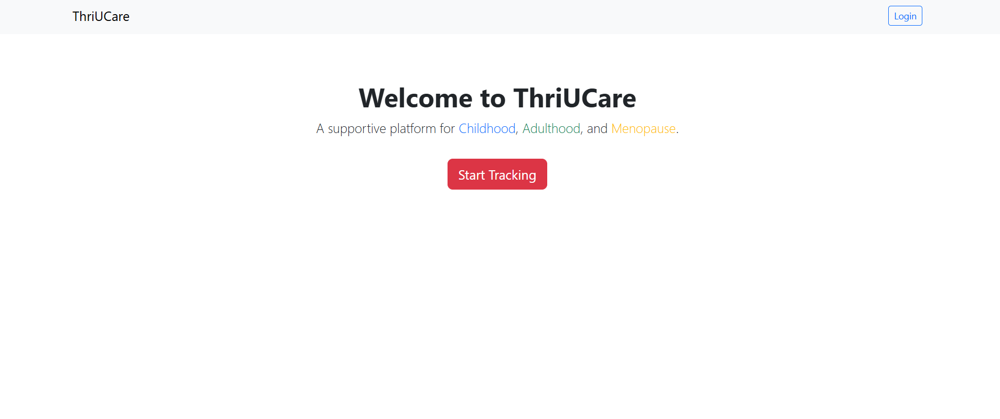
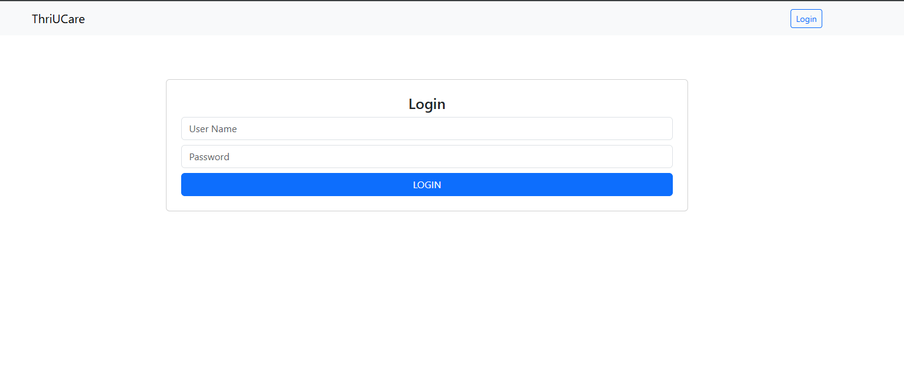
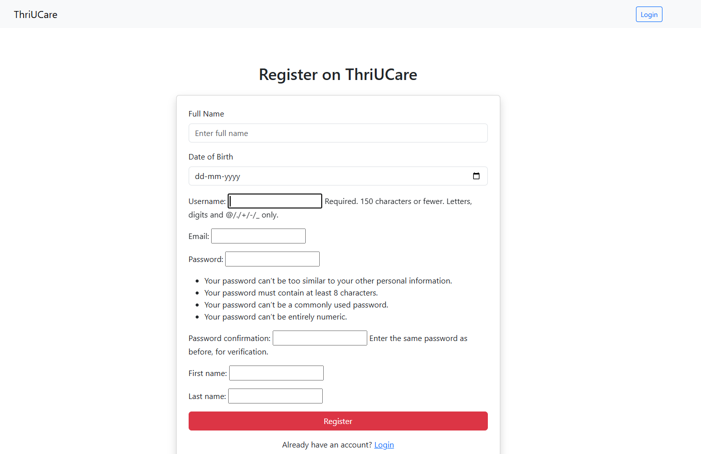
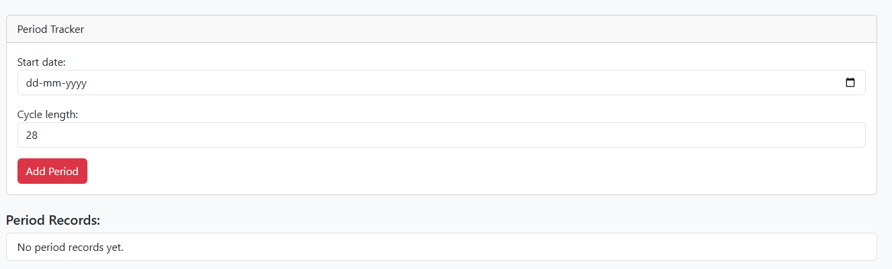
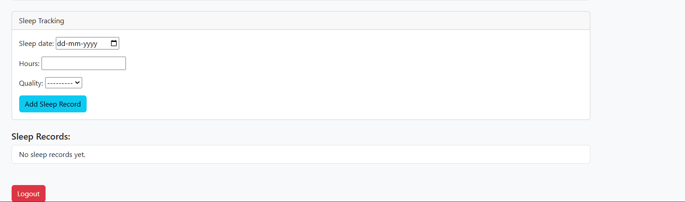
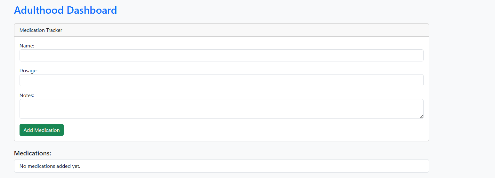
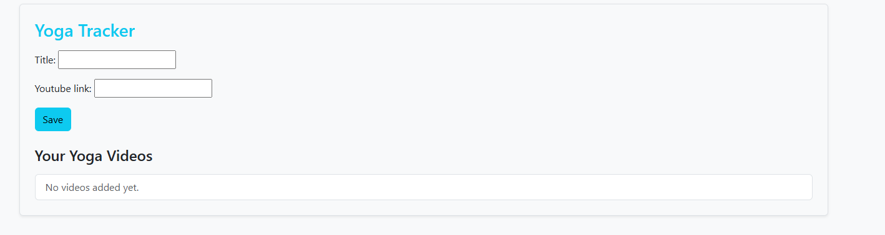

# ThriUCare

A comprehensive healthcare platform designed to support women's health across different life stages, including adolescence, adulthood, and menopause.

## 🚀 Live Demo

https://thriucare.onrender.com/

## 📌 Features

- 👤 User Registration & Login
- 🔐 Secure Authentication
- 🩸 Period Tracking
- 😴 Sleep Tracking
- 😊 Mood Tracking
- 💧 Water Intake Monitoring
- 🌸 Menopause Support
- 👶 Child Health Guidance
- 📧 Email Notifications
- 📱 Responsive User Interface

## 🛠️ Tech Stack

### Frontend
- HTML
- CSS
- JavaScript

### Backend
- Python
- Django

### Database
- Started with SQLite and later moved on to mySQL

### Deployment
- Render
### Version Control
- Git
- GitHub
## 📂 Project Structure

```
thriUCare/
│
├── core/
├── templates/
├── static/
├── manage.py
├── requirements.txt
└── README.md
```
## 📸 Screenshots

### 🏠 Home Page



### 🔐 Login Page



### 📝 Registration Page



### 🩸 Period Tracker



### 😴 Sleep Tracking



### 💊 Medication Tracker



### 🧘 Yoga Tracker



## ⚙️ Installation

Clone the repository

```bash
git clone https://github.com/kuchipudirekha/ThriUCare.git
```
Move into the project

```bash
cd ThriUCare
```

Install dependencies

```bash
pip install -r requirements.txt
```

Run migrations

```bash
python manage.py migrate
```

Run the server

```bash
python manage.py runserver
```
## 🌐 Live Website

https://thriucare.onrender.com/
